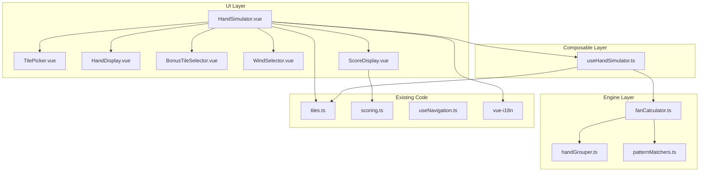

# Design Document: Hand Simulation

## Overview

The Hand Simulation feature adds an interactive Mahjong hand builder and Fan calculator to the existing Hong Kong Mahjong rules guide. Users select tiles from a visual picker, configure game context (round wind, seat wind, self-draw), add bonus tiles (flowers/seasons), and receive an automatic Fan score breakdown with payout calculation.

The feature integrates into the existing Vue 3 + TypeScript + Vite app as a new section, reusing the established tile rendering system (`getTileImageUrl`, `getTileName`), scoring data (`scoringEntries`), i18n infrastructure (`vue-i18n`), and navigation patterns (`useNavigation`).

### Key Design Decisions

1. **Pure function scoring engine** — The Fan calculation logic is implemented as pure TypeScript functions with no Vue dependencies, making it independently testable and reusable. The engine lives in `src/engine/` separate from UI components.

2. **Optimal grouping via exhaustive search** — A 14-tile hand can be grouped into sets and pairs in multiple ways. The engine tries all valid groupings and picks the one yielding the highest Fan. Given the constrained input size (14 tiles, max 4 copies each), exhaustive search is tractable.

3. **Composable-based state management** — A `useHandSimulator` composable owns all reactive state (selected tiles, bonus tiles, wind settings, self-draw flag) and exposes computed scoring results. This follows the existing composable pattern (`useSearch`, `useLocale`, `useNavigation`).

4. **Reuse existing tile infrastructure** — Tile images, names, and codes all use the existing `TileCode` type and helper functions from `src/data/tiles.ts`. No new tile asset system is needed.

## Architecture



### Layer Responsibilities

**UI Layer** — Vue single-file components handling user interaction and display. Each component has a single responsibility:
- `HandSimulator.vue` — Container component, orchestrates sub-components
- `TilePicker.vue` — Displays all 34 tile types, handles tile selection, shows availability
- `HandDisplay.vue` — Shows the current 14-tile hand with remove actions
- `BonusTileSelector.vue` — Toggle buttons for 8 flower/season bonus tiles
- `WindSelector.vue` — Radio groups for round wind and seat wind
- `ScoreDisplay.vue` — Fan breakdown, pattern matches, payout calculation

**Composable Layer** — `useHandSimulator` manages all reactive state and connects UI events to the engine. Returns computed properties for the score result.

**Engine Layer** — Pure TypeScript functions with no Vue or DOM dependencies:
- `handGrouper.ts` — Finds all valid ways to partition 14 tiles into 4 sets + 1 pair
- `patternMatchers.ts` — Individual pattern detection functions (one per scoring pattern)
- `fanCalculator.ts` — Orchestrates grouping and pattern matching, returns the optimal score

## Components and Interfaces

### New Components

#### `HandSimulator.vue`
The top-level container for the feature. Mounted as a new section in `App.vue`.

```typescript
// Props: none (self-contained section)
// Uses: useHandSimulator composable
// Template structure:
// <section id="hand-simulation">
//   <h2>{{ $t('sections.handSimulation.heading') }}</h2>
//   <TilePicker :available-counts="availableCounts" @select="addTile" />
//   <HandDisplay :tiles="handTiles" @remove="removeTile" />
//   <BonusTileSelector :selected="bonusTiles" @toggle="toggleBonus" />
//   <WindSelector v-model:round-wind="roundWind" v-model:seat-wind="seatWind" />
//   <label><input type="checkbox" v-model="selfDraw" /> Self-Draw</label>
//   <button @click="clearHand">Clear Hand</button>
//   <ScoreDisplay :result="scoreResult" :self-draw="selfDraw" />
// </section>
```

#### `TilePicker.vue`
Displays all 34 unique tile types organized by suit. Each tile is a button.

```typescript
interface TilePickerProps {
  availableCounts: Record<TileCode, number>  // remaining copies available (0–4)
  disabled: boolean                           // true when hand has 14 tiles
}

interface TilePickerEmits {
  select: [tile: TileCode]
}
```

Tiles are organized in rows: Characters, Dots, Bamboo, Winds, Dragons. Each tile button shows the tile image and a small count badge. Disabled when `availableCounts[tile] === 0` or `disabled === true`.

#### `HandDisplay.vue`
Shows the tiles currently in the hand. Each tile is clickable to remove.

```typescript
interface HandDisplayProps {
  tiles: TileCode[]  // ordered list of tiles in the hand
}

interface HandDisplayEmits {
  remove: [index: number]
}
```

#### `BonusTileSelector.vue`
Toggle buttons for 8 bonus tiles (Flower 1–4, Season 1–4).

```typescript
interface BonusTileSelectorProps {
  selected: Set<string>  // e.g. Set(['flower-1', 'season-3'])
}

interface BonusTileSelectorEmits {
  toggle: [id: string]
}
```

#### `WindSelector.vue`
Two radio button groups for round wind and seat wind.

```typescript
interface WindSelectorProps {
  roundWind: WindTile   // 'f1' | 'f2' | 'f3' | 'f4'
  seatWind: WindTile
}

interface WindSelectorEmits {
  'update:roundWind': [wind: WindTile]
  'update:seatWind': [wind: WindTile]
}
```

#### `ScoreDisplay.vue`
Shows the scoring result: matched patterns, bonus Fan, total, and payout.

```typescript
interface ScoreDisplayProps {
  result: ScoreResult | null
  selfDraw: boolean
}
```

### Composable: `useHandSimulator`

```typescript
// src/composables/useHandSimulator.ts
import type { TileCode } from '../data/tiles'
import type { ScoreResult } from '../engine/fanCalculator'

type WindTile = 'f1' | 'f2' | 'f3' | 'f4'

interface UseHandSimulatorReturn {
  // State
  handTiles: Ref<TileCode[]>
  bonusTiles: Ref<Set<string>>
  roundWind: Ref<WindTile>
  seatWind: Ref<WindTile>
  selfDraw: Ref<boolean>

  // Computed
  availableCounts: ComputedRef<Record<TileCode, number>>
  isHandFull: ComputedRef<boolean>
  scoreResult: ComputedRef<ScoreResult | null>

  // Actions
  addTile: (tile: TileCode) => void
  removeTile: (index: number) => void
  toggleBonus: (id: string) => void
  clearHand: () => void
}
```

### Engine Interfaces

```typescript
// src/engine/types.ts

import type { TileCode } from '../data/tiles'

export type WindTile = 'f1' | 'f2' | 'f3' | 'f4'

/** A group of tiles in a winning hand */
export interface TileGroup {
  type: 'chow' | 'pung' | 'kong' | 'pair'
  tiles: TileCode[]
}

/** A valid partition of 14 tiles into sets + pair */
export interface HandGrouping {
  sets: TileGroup[]   // 4 sets (chow/pung/kong)
  pair: TileGroup     // 1 pair
}

/** A matched scoring pattern */
export interface MatchedPattern {
  id: string          // matches ScoringEntry.id
  englishName: string
  chineseName: string
  fan: number
}

/** Complete scoring result for a hand */
export interface ScoreResult {
  isValid: boolean
  handType: 'standard' | 'seven-pairs' | 'thirteen-orphans' | 'invalid'
  grouping: HandGrouping | null
  matchedPatterns: MatchedPattern[]
  bonusFan: number          // flowers + seasons
  windFan: number           // round wind + seat wind
  selfDrawFan: number       // 0 or 1
  totalFan: number          // capped at 8
  payoutPerPerson: number   // 2^totalFan
}
```

## Data Models

### Tile Representation

The existing `TileCode` type from `src/data/tiles.ts` is used throughout. No new tile types are introduced.

```typescript
// Existing — reused as-is
export type TileCode =
  | `w${1|2|3|4|5|6|7|8|9}`   // Characters
  | `t${1|2|3|4|5|6|7|8|9}`   // Dots
  | `s${1|2|3|4|5|6|7|8|9}`   // Bamboo
  | `f${1|2|3|4}`              // Winds
  | `d${1|2|3}`                // Dragons
```

### Hand State

The hand is stored as a flat `TileCode[]` array (length 0–14). This is the simplest representation for the UI and is converted to a frequency map for the engine.

```typescript
// Frequency map used internally by the engine
type TileFrequencyMap = Map<TileCode, number>

function toFrequencyMap(tiles: TileCode[]): TileFrequencyMap {
  const map = new Map<TileCode, number>()
  for (const tile of tiles) {
    map.set(tile, (map.get(tile) ?? 0) + 1)
  }
  return map
}
```

### Bonus Tiles

Bonus tiles are tracked as a `Set<string>` with IDs like `'flower-1'`, `'flower-2'`, `'season-1'`, etc. The Fan contribution is simply the set size.

### Scoring Pattern Data

The existing `scoringEntries` array from `src/data/scoring.ts` provides the pattern metadata (id, names, fan values, limit flag). The engine references these IDs when reporting matched patterns.

### Tile Grouping Algorithm

The hand grouper converts 14 tiles into valid groupings. The algorithm:

1. **Convert to frequency map** — Count occurrences of each tile.
2. **Check special hands first** — Test for Seven Pairs (7 distinct pairs) and Thirteen Orphans (specific 13+1 pattern). These bypass normal grouping.
3. **Recursive set extraction** — For standard hands, recursively try extracting pungs and chows from the frequency map. When exactly 2 tiles remain and they form a pair, record the grouping.
4. **Collect all valid groupings** — Return all possible ways to partition the tiles.

The Fan calculator then scores each grouping and returns the one with the highest total Fan.

### Pattern Matching

Each scoring pattern has a dedicated matcher function:

```typescript
// Example matcher signatures
function isCommonHand(grouping: HandGrouping): boolean
function isAllPungs(grouping: HandGrouping): boolean
function isMixedOneSuit(tiles: TileCode[]): boolean
function isFullOneSuit(tiles: TileCode[]): boolean
function countDragonPungs(grouping: HandGrouping): number
function isSmallThreeDragons(grouping: HandGrouping): boolean
function isGreatThreeDragons(grouping: HandGrouping): boolean
function isGreatFourWinds(grouping: HandGrouping): boolean
function isAllGreen(tiles: TileCode[]): boolean
function isSevenPairs(tiles: TileCode[]): boolean
function isThirteenOrphans(tiles: TileCode[]): boolean
```

Some matchers operate on the grouping (set structure matters), others on the raw tile list (only tile identity matters).

### Wind Bonus Calculation

```typescript
function calculateWindFan(
  grouping: HandGrouping,
  roundWind: WindTile,
  seatWind: WindTile
): number {
  let fan = 0
  for (const set of grouping.sets) {
    if (set.type === 'pung' && set.tiles[0] === roundWind) fan += 1
    if (set.type === 'pung' && set.tiles[0] === seatWind) fan += 1
  }
  return fan
}
```

When round wind equals seat wind and the hand has a pung of that wind, this naturally yields +2 Fan (one for each role).

### Payout Calculation

```typescript
function calculatePayout(totalFan: number): number {
  return Math.pow(2, totalFan)
}
```

The payout display varies by win method:
- **Self-draw**: All 3 opponents pay `2^n` each
- **Discard win**: Shooter pays `2 × 2^n`, other two pay `2^n` each


## Correctness Properties

*A property is a characteristic or behavior that should hold true across all valid executions of a system — essentially, a formal statement about what the system should do. Properties serve as the bridge between human-readable specifications and machine-verifiable correctness guarantees.*

### Property 1: Tile addition preserves hand invariants

*For any* hand with fewer than 14 tiles and *for any* TileCode that has fewer than 4 copies in the hand, adding that tile should increase the hand length by exactly 1, the added tile should appear in the hand, and no tile in the resulting hand should have more than 4 copies.

**Validates: Requirements 1.2, 1.5**

### Property 2: Hand fullness reflects tile count

*For any* hand of size 0–13, `isHandFull` should be false. *For any* hand of exactly 14 tiles, `isHandFull` should be true and further tile additions should be rejected (hand length remains 14).

**Validates: Requirements 1.3, 1.4**

### Property 3: Tile removal decreases hand size

*For any* non-empty hand and *for any* valid index within that hand, removing the tile at that index should decrease the hand length by exactly 1 and the remaining tiles should be the original tiles minus the one at the removed index.

**Validates: Requirements 1.7**

### Property 4: Bonus tile toggle round-trip

*For any* bonus tile ID, toggling it on when it is not selected should add it to the set, and toggling it again should remove it. After two toggles, the bonus tile set should be identical to the original state.

**Validates: Requirements 2.2, 2.3**

### Property 5: Bonus Fan equals bonus tile count

*For any* set of selected bonus tiles (0–8), the `bonusFan` in the score result should equal the number of selected bonus tiles.

**Validates: Requirements 2.5**

### Property 6: Self-draw Fan is conditional

*For any* valid 14-tile hand, when `selfDraw` is true the `selfDrawFan` should be 1, and when `selfDraw` is false the `selfDrawFan` should be 0.

**Validates: Requirements 3.2, 3.3**

### Property 7: Wind pung bonus

*For any* wind tile (f1–f4) and *for any* valid hand grouping containing a pung of that wind tile, setting that wind as the round wind should contribute +1 to `windFan`, and setting it as the seat wind should contribute +1 to `windFan`. When the same wind is both round and seat wind, `windFan` should be +2.

**Validates: Requirements 4.4, 4.5, 4.6**

### Property 8: Optimal grouping maximizes Fan

*For any* 14 tiles that form a valid winning hand, the Fan score returned by the calculator should be greater than or equal to the Fan score of every other valid grouping of those same tiles.

**Validates: Requirements 5.6, 5.3, 5.4**

### Property 9: Invalid hand detection

*For any* 14 tiles that cannot be partitioned into a valid winning structure (4 sets + 1 pair, Seven Pairs, or Thirteen Orphans), the score result should have `isValid` equal to false and `handType` equal to `'invalid'`.

**Validates: Requirements 5.7**

### Property 10: Total Fan computation with cap

*For any* valid hand with any combination of pattern Fan, bonus Fan, wind Fan, and self-draw Fan, the `totalFan` should equal `min(8, patternFanSum + bonusFan + windFan + selfDrawFan)` and should never exceed 8.

**Validates: Requirements 6.3, 5.5**

### Property 11: Payout formula

*For any* `totalFan` value in the range [0, 8], the `payoutPerPerson` should equal `2^totalFan`.

**Validates: Requirements 6.4**

### Property 12: Clear resets all state to defaults

*For any* simulator state (any combination of hand tiles, bonus tiles, self-draw flag, and wind settings), invoking `clearHand` should result in: handTiles is empty, bonusTiles is empty, selfDraw is false, roundWind is 'f1', and seatWind is 'f1'.

**Validates: Requirements 7.2, 7.3, 7.4, 7.5**

## Error Handling

### Invalid Hand Structure
When 14 tiles cannot form a valid winning hand, the engine returns `isValid: false` with `handType: 'invalid'`. The UI displays a localized message explaining the hand doesn't form a valid winning structure. No Fan or payout is shown.

### Incomplete Hand
When fewer than 14 tiles are selected, `scoreResult` is `null`. The UI shows a message indicating how many more tiles are needed (e.g., "Select 6 more tiles to complete the hand").

### Tile Limit Enforcement
The `addTile` function silently rejects additions when:
- The hand already has 14 tiles
- The tile already has 4 copies in the hand

The UI prevents these states by disabling the relevant tile buttons, so the rejection is a safety net rather than a user-facing error.

### Edge Cases
- **All tiles are honors** — Valid if they form pungs/pairs (e.g., Great Four Winds). The grouper handles this.
- **Kong tiles** — The simulator does not support Kong declaration (which requires 4 identical tiles as a set). Users build standard 14-tile hands. A hand with 4 identical tiles will use 3 as a pung and 1 elsewhere, or the grouper will find no valid grouping.
- **Zero Fan** — If a valid hand has 0 pattern Fan and no bonuses, the total is 0 Fan with payout of 1 (2^0). This is correct per the formula.

## Testing Strategy

### Unit Tests (Example-Based)

Unit tests cover specific scenarios, UI integration points, and edge cases:

- **Pattern matchers**: Test each pattern matcher with known hands that should and shouldn't match (e.g., a known All Pungs hand, a known Common Hand, Thirteen Orphans).
- **Hand grouper**: Test with known hands that have exactly one valid grouping and hands with multiple valid groupings.
- **Wind bonus**: Test specific wind configurations (round = seat, round ≠ seat, no wind pung).
- **UI defaults**: Verify initial state (empty hand, no bonus tiles, selfDraw false, winds East).
- **i18n keys**: Verify all translation keys exist in both en.json and th.json.
- **Edge cases**: 14 tiles that form no valid hand, hands at the 8-Fan limit, hands with 0 Fan.

### Property-Based Tests

Property-based tests verify the 12 correctness properties above using `vitest` with a property-based testing library (fast-check).

**Configuration:**
- Library: [fast-check](https://github.com/dubzzz/fast-check) — the standard PBT library for TypeScript/JavaScript
- Minimum iterations: 100 per property
- Each test tagged with: `Feature: hand-simulation, Property {N}: {title}`

**Custom Generators:**
- `arbTileCode` — Generates a random valid `TileCode` from the 34 possible values
- `arbHand(size)` — Generates a random hand of `size` tiles respecting the 4-copy-per-tile limit
- `arbValidHand` — Generates a random 14-tile hand that forms a valid winning structure (by constructing from known valid groupings)
- `arbInvalidHand` — Generates a random 14-tile hand that does not form a valid winning structure
- `arbWindTile` — Generates a random wind tile ('f1'–'f4')
- `arbBonusTileSet` — Generates a random subset of the 8 bonus tile IDs
- `arbHandGrouping` — Generates a valid HandGrouping (4 sets + 1 pair) for testing pattern matchers

**Test Organization:**
```
tests/unit/
  engine/
    fanCalculator.test.ts      — Properties 8, 10, 11 + unit tests
    handGrouper.test.ts        — Property 9 + unit tests
    patternMatchers.test.ts    — Unit tests for each pattern
  composables/
    useHandSimulator.test.ts   — Properties 1–7, 12 + unit tests
```
