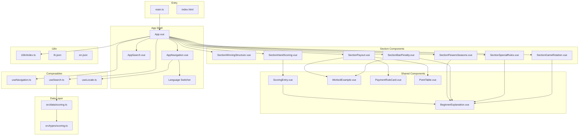

# Design Document: Mahjong Guide Redesign

## Overview

This design describes the complete restructuring of the Mahjong Hong Kong Rules Guide from a category-based layout (Scoring → Payout Table → Payment Rules → Special Rules) to a learning-progression layout with 7 sequential sections. The redesign narrows the content width from 960px to 720px, updates all content to match the house rules document (`simple-mahjong.md`), and restructures the navigation, data layer, and i18n keys accordingly.

The existing Vue 3 + Vite + TypeScript + vue-i18n stack is retained. The redesign reuses several existing components (BeginnerExplanation, WorkedExample, ScoringEntry, AppSearch) with modifications, replaces the navigation and top-level layout components, and introduces new section components for the 7-section structure.

### Key Design Decisions

1. **Section-per-component architecture**: Each of the 7 content sections gets its own Vue component. This keeps each file focused and makes the section order explicit in `App.vue`.
2. **Flat data module**: The current category-based `scoring.ts` data module is replaced with a section-oriented structure. Scoring entries remain typed the same way but are grouped by the new section boundaries.
3. **Navigation rewrite**: The `useNavigation` composable and `AppNavigation` component are rewritten to reflect the 7 new section IDs. The IntersectionObserver approach for active-section tracking is retained.
4. **i18n key restructuring**: Keys are reorganized under a `sections.*` namespace matching the 7 sections, plus new keys for content that didn't exist before (Winning Structure, Biting examples, Bao worked example, Game Rotation).
5. **720px max-width**: The `.content-area` max-width changes from 960px to 720px. No other layout paradigm changes — the sidebar + main flex layout is preserved.

## Architecture

The application remains a single-page Vue 3 SPA with no routing. The architecture follows the existing pattern: a root `App.vue` orchestrates section components, a data module provides typed content, composables handle cross-cutting concerns (search, navigation, locale), and vue-i18n handles translations.



### Section Order and IDs

| # | Section | Component | HTML `id` |
|---|---------|-----------|-----------|
| 1 | Introduction & Winning Structure | `SectionWinningStructure.vue` | `winning-structure` |
| 2 | Hand Scoring / Fan Counting | `SectionHandScoring.vue` | `hand-scoring` |
| 3 | Flowers, Seasons & Biting | `SectionFlowersSeasons.vue` | `flowers-seasons` |
| 4 | Payout & The Exponential Rule | `SectionPayout.vue` | `payout` |
| 5 | Bao Penalty / Full Liability | `SectionBaoPenalty.vue` | `bao-penalty` |
| 6 | Special Rules | `SectionSpecialRules.vue` | `special-rules` |
| 7 | Game Rotation | `SectionGameRotation.vue` | `game-rotation` |

## Components and Interfaces

### New Components

#### `SectionWinningStructure.vue`
Displays the Mok concept, Standard Hand structure (4 Sets + 1 Pair), and Special Hands (Seven Pairs, Thirteen Orphans). All content is i18n-driven. Includes BeginnerExplanation blocks for each concept.

**Props**: None (reads i18n keys directly)

#### `SectionHandScoring.vue`
Renders all scoring entries using the existing `ScoringEntry` component. Entries are imported from the data module. The FaanLimitNote is displayed at the top of this section.

**Props**: None (imports `scoringEntries` from data module)

#### `SectionFlowersSeasons.vue`
Explains Flower/Season scoring (+1 Fan each), the Biting/Kud rule, the absence of a No Flower Bonus, and includes a worked example for Biting penalty calculation.

**Props**: None (reads i18n keys and imports relevant worked example from data module)

#### `SectionPayout.vue`
Displays the payout formula, the Fan-to-price table (reuses `PointTable`), Self-Draw and Win by Discard rules (reuses `PaymentRuleCard`), and worked examples (reuses `WorkedExample`).

**Props**: None (imports data from data module)

#### `SectionBaoPenalty.vue`
Explains the Bao penalty concept, lists all 4 trigger conditions, includes a BeginnerExplanation and a WorkedExample.

**Props**: None (reads i18n keys and imports Bao worked example from data module)

#### `SectionSpecialRules.vue`
Covers Mok (minimum Fan), Kong, and Sacred Discard rules. Each rule gets a description and BeginnerExplanation.

**Props**: None (reads i18n keys)

#### `SectionGameRotation.vue`
Explains the 4-round structure and dealer rotation rules with BeginnerExplanation.

**Props**: None (reads i18n keys)

### Modified Components

#### `AppNavigation.vue`
Updated section list from 4 items to 7 items matching the new section IDs. The Language Switcher remains in the nav. Mobile horizontal bar and desktop sticky sidebar behavior are preserved.

#### `App.vue`
Replaces the 4-section layout with 7 section components in fixed order. The search overlay mode is preserved — when searching, section components are hidden and filtered `ScoringEntry` results are shown. The `.content-area` max-width changes from 960px to 720px.

#### `AppSearch.vue`
No structural changes. The search input remains at the top of the content area.

### Reused Components (No Changes)

- **`BeginnerExplanation.vue`** — Used across all sections
- **`WorkedExample.vue`** — Used in Payout, Bao, and Flowers sections
- **`ScoringEntry.vue`** — Used in Hand Scoring section and search results
- **`PaymentRuleCard.vue`** — Used in Payout section
- **`PointTable.vue`** — Used in Payout section

### Removed Components

- **`ScoringCategories.vue`** — Replaced by `SectionHandScoring.vue` which renders entries directly without the category grouping wrapper
- **`PointTranslationTables.vue`** — Its functionality is absorbed into `SectionPayout.vue`
- **`Penalties.vue`** — Split across `SectionBaoPenalty.vue` and `SectionSpecialRules.vue`
- **`PenaltyCard.vue`** — Replaced by inline rendering in the new section components using `BeginnerExplanation` directly
- **`FaanLimitNote.vue`** — Absorbed into `SectionHandScoring.vue` as an inline aside

### Modified Composables

#### `useNavigation.ts`
The `SECTIONS` constant changes from `['scoring', 'point-tables', 'payment-rules', 'penalties']` to `['winning-structure', 'hand-scoring', 'flowers-seasons', 'payout', 'bao-penalty', 'special-rules', 'game-rotation']`. The IntersectionObserver logic and `scrollToSection` function remain the same.

#### `useSearch.ts`
The `flattenEntries` function is updated to work with the new flat `scoringEntries` array (no longer nested in categories). The `filterScoringEntries` function signature stays the same. The `useSearch` composable is updated to accept the flat array directly.

#### `useLocale.ts`
No changes needed.

## Data Models

### Updated Type Definitions (`src/types/scoring.ts`)

The existing types are mostly retained. Changes:

1. **`ScoringCategory` is removed** — entries are no longer grouped by category in the data layer. The `SectionHandScoring` component renders them as a flat list.
2. **`ScoringEntry` gains an optional `stackable` field** — to indicate entries like Dragon Pung where the bonus can be applied multiple times.
3. **`Penalty` type is removed** — penalty/special rule content moves to i18n keys rendered directly by section components.
4. **`BaoTrigger` type is added** — for the list of Bao trigger conditions.

```typescript
// src/types/scoring.ts

export interface ScoringEntry {
  id: string
  englishName: string
  chineseName: string
  faan: number
  descriptionKey: string
  beginnerExplanationKey: string
  notesKey: string | null
  isMaxLimit: boolean
  stackable?: boolean  // NEW: true for entries like Dragon Pung
}

// ScoringCategory removed — entries are a flat array

export interface PointTranslationRow {
  faanRange: string
  points: number
}

export interface PointTranslationTable {
  id: string
  titleKey: string
  minFaan: number
  maxFaan: number | null
  rows: PointTranslationRow[]
}

export interface PaymentRule {
  id: string
  titleKey: string
  descriptionKey: string
  beginnerExplanationKey: string
  multiplier: string | null
}

// Penalty type removed — content is i18n-driven in section components

export interface BaoTrigger {
  id: string
  titleKey: string
  descriptionKey: string
}

export interface WorkedExampleStep {
  stepNumber: number
  descriptionKey: string
  calculationKey: string | null
}

export interface WorkedExample {
  id: string
  titleKey: string
  contextKey: string
  steps: WorkedExampleStep[]
  relatedRuleId: string
}
```

### Updated Data Module (`src/data/scoring.ts`)

Key changes to the data module:

1. **`scoringCategories` → `scoringEntries`**: A flat `ScoringEntry[]` array containing all hand types in display order. The "No Flowers" entry is removed (house rules state no bonus for zero flowers).
2. **`penalties` array removed**: Bao, Kong, Sacred Discard, Mok content moves to i18n keys.
3. **`baoTriggers` added**: A `BaoTrigger[]` array for the 4 Bao trigger conditions.
4. **New worked examples added**: Bao penalty example, Biting penalty example.
5. **Win by Discard payment rule updated**: Description updated to match house rules (Shooter pays double, other two pay standard).
6. **Dealer modifier removed from `paymentRules`**: The dealer modifier is documented as a note within the Payout section's i18n content rather than as a separate payment rule card, since it's a modifier on all payments rather than a standalone rule.

### i18n Key Structure

Keys are reorganized under `sections.*` for section-level headings and content. Existing scoring entry keys (`scoring.*`) are retained. New keys are added for:

- `sections.winningStructure.*` — Mok, Standard Hand, Special Hands content
- `sections.flowersSeasons.*` — Biting rule explanation and example
- `sections.payout.*` — Formula explanation, dealer modifier note
- `sections.baoPenalty.*` — Bao concept, trigger list, worked example
- `sections.specialRules.*` — Kong, Sacred Discard
- `sections.gameRotation.*` — Round structure, dealer rotation
- `nav.*` — Updated navigation labels for 7 sections

### CSS Changes (`src/assets/main.css`)

1. `.content-area` max-width changes from `960px` to `720px`
2. Section separator styles added (bottom border or margin between sections)
3. Section heading styles standardized
4. All existing color variables and contrast ratios are preserved (they already meet WCAG AA 4.5:1)

