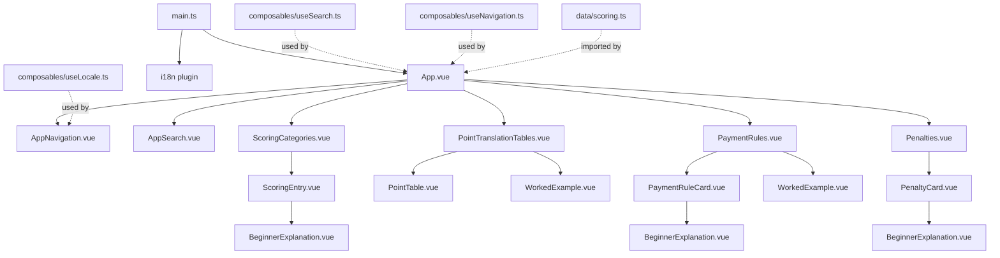
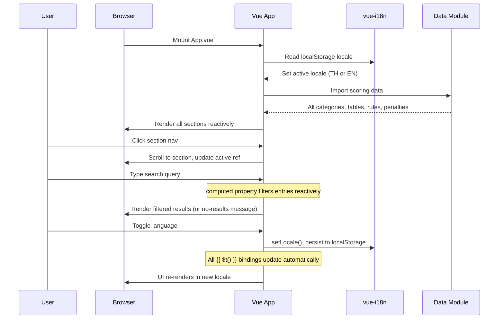

# Design Document: Mahjong HK Rules Guide

## Overview

The Mahjong Hong Kong Rules Guide is a single-page web application (SPA) that serves as an interactive reference for Hong Kong Mahjong scoring rules. It presents scoring categories, faan values, point translation tables, payment rules, and penalties in a browsable, searchable, and beginner-friendly format.

### Design Goals

- **Component-based**: Vue 3 Single File Components with Composition API (`<script setup lang="ts">`) for clean, maintainable code with full type safety.
- **Static data**: All Mahjong scoring data is embedded as TypeScript modules — no backend or API needed.
- **Beginner-friendly**: Every complex rule includes a "What this means" plain-language explanation and worked payment examples with step-by-step calculations.
- **Bilingual**: Thai (default) and English with a language switcher via `vue-i18n`. Mahjong terminology stays untranslated in both locales.
- **Responsive**: Single-column on mobile (<768px), sidebar navigation on desktop (≥768px).
- **Accessible**: Semantic HTML, keyboard navigation, ARIA labels, 4.5:1 contrast ratio.

### Tech Stack Decision

This is a V1 reference guide with static content and moderate interactivity (search, navigation, language switching). Vue 3 provides reactive data binding and component composition that simplifies search filtering, locale switching, and section rendering compared to manual DOM manipulation. The Composition API with `<script setup>` is concise and approachable for developers familiar with Vue 2.

| Layer | Choice | Rationale |
|-------|--------|-----------|
| Language | TypeScript | Type safety for data models, composables, and component props |
| Framework | Vue 3 (Composition API) | Reactive data binding, component composition, `<script setup lang="ts">` syntax |
| Build | Vite | Fast dev server, HMR, comes with Vue 3 scaffold via `create-vue` |
| i18n | vue-i18n | Official Vue i18n plugin — locale-reactive translations, lazy loading support |
| Styling | Scoped CSS + global CSS | Scoped styles in `.vue` files for component isolation, global CSS for shared styles |
| Data | Embedded TS modules | Static scoring data with typed interfaces, no API calls |
| Testing | Vitest | Unit tests for search filtering logic only |

## Architecture

### High-Level Architecture



### Application Flow



### File Structure

```
mahjong-hongkong-guide/
├── index.html                    # Vite entry HTML
├── vite.config.ts                # Vite configuration
├── tsconfig.json                 # TypeScript configuration
├── tsconfig.app.json             # TypeScript config for app source
├── tsconfig.node.json            # TypeScript config for Node tooling
├── package.json                  # Dependencies and scripts
├── src/
│   ├── main.ts                   # App entry — creates Vue app, installs plugins
│   ├── App.vue                   # Root component — layout, search state, section rendering
│   ├── assets/
│   │   └── main.css              # Global styles (CSS custom properties, resets, shared)
│   ├── components/
│   │   ├── AppNavigation.vue     # Sidebar/mobile nav with section links and language switcher
│   │   ├── AppSearch.vue         # Search input with aria-label
│   │   ├── ScoringCategories.vue # Renders all four scoring category sections
│   │   ├── ScoringEntry.vue      # Single scoring entry card (name, faan, description, notes)
│   │   ├── PointTranslationTables.vue  # Tabbed point tables for three variants
│   │   ├── PointTable.vue        # Single point translation table with min/max faan
│   │   ├── PaymentRules.vue      # Payment rules section
│   │   ├── PaymentRuleCard.vue   # Single payment rule with multiplier display
│   │   ├── Penalties.vue         # Penalties section
│   │   ├── PenaltyCard.vue       # Single penalty card
│   │   ├── BeginnerExplanation.vue  # Reusable "What this means" box
│   │   ├── WorkedExample.vue     # Worked example card with numbered steps
│   │   └── FaanLimitNote.vue     # 13-faan maximum explanation note
│   ├── composables/
│   │   ├── useSearch.ts          # Search filtering logic (computed-based)
│   │   ├── useNavigation.ts      # Scroll-to-section and active section tracking
│   │   └── useLocale.ts          # Locale toggle and localStorage persistence
│   ├── data/
│   │   └── scoring.ts            # Static scoring data with TypeScript interfaces
│   ├── types/
│   │   └── scoring.ts            # TypeScript interfaces for all data models
│   └── i18n/
│       ├── index.ts              # vue-i18n instance creation and configuration
│       ├── th.json               # Thai translations
│       └── en.json               # English translations
└── tests/
    └── unit/
        └── search.test.ts         # Search filtering unit tests
```

## Components and Interfaces

### 1. Entry Point (`src/main.ts`)

Creates the Vue app, installs `vue-i18n`, and mounts to the DOM.

```typescript
// src/main.ts
import { createApp } from 'vue'
import App from './App.vue'
import { i18n } from './i18n/index'
import './assets/main.css'

const app = createApp(App)
app.use(i18n)
app.mount('#app')
```

### 2. I18n Setup (`src/i18n/index.ts`)

Configures `vue-i18n` with Thai as the default locale and localStorage persistence.

```typescript
// src/i18n/index.ts
import { createI18n } from 'vue-i18n'
import th from './th.json'
import en from './en.json'

export const STORAGE_KEY = 'mahjong-guide-locale'
export const DEFAULT_LOCALE = 'th'
export const SUPPORTED_LOCALES = ['th', 'en'] as const

export type SupportedLocale = typeof SUPPORTED_LOCALES[number]

/**
 * Read stored locale from localStorage.
 * Falls back to 'th' if unavailable, missing, or invalid.
 */
function getStoredLocale(): SupportedLocale {
  try {
    const stored = localStorage.getItem(STORAGE_KEY)
    return (SUPPORTED_LOCALES as readonly string[]).includes(stored ?? '') 
      ? (stored as SupportedLocale) 
      : DEFAULT_LOCALE
  } catch {
    return DEFAULT_LOCALE
  }
}

export const i18n = createI18n({
  legacy: false,
  locale: getStoredLocale(),
  fallbackLocale: 'en',
  messages: { th, en }
})
```

**Key design decisions:**
- `legacy: false` enables the Composition API mode of `vue-i18n`, which works with `<script setup>` and provides `useI18n()`.
- Both translation files are eagerly loaded (small static content — no need for lazy loading in V1).
- The `getStoredLocale()` function wraps `localStorage` access in a try-catch to handle environments where `localStorage` is unavailable.

### 3. Root Component (`src/App.vue`)

Orchestrates layout, search state, and section rendering. Uses composables for search and navigation logic.

```vue
<!-- src/App.vue -->
<script setup lang="ts">
import { ref } from 'vue'
import { useI18n } from 'vue-i18n'
import { scoringCategories, pointTranslationTables, paymentRules, penalties, workedExamples } from './data/scoring'
import { useSearch } from './composables/useSearch'
import { useNavigation } from './composables/useNavigation'
import AppNavigation from './components/AppNavigation.vue'
import AppSearch from './components/AppSearch.vue'
import ScoringCategories from './components/ScoringCategories.vue'
import PointTranslationTables from './components/PointTranslationTables.vue'
import PaymentRules from './components/PaymentRules.vue'
import Penalties from './components/Penalties.vue'
import FaanLimitNote from './components/FaanLimitNote.vue'

const { t } = useI18n()

const searchTerm = ref('')
const { filteredEntries, hasResults, isSearching } = useSearch(searchTerm, scoringCategories, t)
const { activeSection, scrollToSection } = useNavigation()
</script>

<template>
  <div class="app-layout">
    <AppNavigation
      :active-section="activeSection"
      @navigate="scrollToSection"
    />
    <main class="content-area">
      <AppSearch v-model="searchTerm" />
      <template v-if="isSearching">
        <section v-if="hasResults" class="search-results">
          <!-- Render filtered entries -->
        </section>
        <section v-else class="no-results">
          <p>{{ $t('search.noResults') }}</p>
        </section>
      </template>
      <template v-else>
        <ScoringCategories id="scoring" :categories="scoringCategories" />
        <FaanLimitNote />
        <PointTranslationTables id="point-tables" :tables="pointTranslationTables" :examples="workedExamples" />
        <PaymentRules id="payment-rules" :rules="paymentRules" :examples="workedExamples" />
        <Penalties id="penalties" :penalties="penalties" />
      </template>
    </main>
  </div>
</template>

<style scoped>
.app-layout {
  display: flex;
  min-height: 100vh;
}
.content-area {
  flex: 1;
  padding: 1rem;
  max-width: 960px;
  margin: 0 auto;
}
@media (max-width: 767px) {
  .app-layout {
    flex-direction: column;
  }
}
</style>
```

### 4. Data Module (`src/data/scoring.ts`)

Holds all static Mahjong scoring data as exported TypeScript objects. Types are defined in `src/types/scoring.ts`. Text content is stored as i18n keys that resolve to locale-specific strings via `vue-i18n`'s `$t()` function at render time.

```typescript
// src/types/scoring.ts

export interface ScoringEntry {
  id: string                    // Unique identifier (e.g., "all-in-triplets")
  englishName: string           // English name of the hand/condition (never translated)
  chineseName: string           // Chinese/Cantonese name (never translated)
  faan: number                  // Faan value (integer, 1-13)
  descriptionKey: string        // i18n key for formal description
  beginnerExplanationKey: string // i18n key for "What this means" text
  notesKey: string | null       // i18n key for special notes/exceptions (nullable)
  isMaxLimit: boolean           // True if faan === 13
}

export interface ScoringCategory {
  id: string                    // Category identifier
  titleKey: string              // i18n key for category title
  entries: ScoringEntry[]       // Scoring entries in this category
}

export interface PointTranslationRow {
  faanRange: string             // Faan range label (e.g., "3", "4", "5-6")
  points: number                // Base point value
}

export interface PointTranslationTable {
  id: string                    // Variant identifier ("simplified", "traditional", "canton")
  titleKey: string              // i18n key for variant name
  minFaan: number               // Minimum faan requirement
  maxFaan: number | null        // Maximum faan cap (null if uncapped up to 13)
  rows: PointTranslationRow[]   // Faan-to-points mappings
}

export interface PaymentRule {
  id: string                    // Rule identifier
  titleKey: string              // i18n key for rule title
  descriptionKey: string        // i18n key for formal description
  beginnerExplanationKey: string // i18n key for "What this means"
  multiplier: string | null     // Multiplier text (e.g., "2x") or null
}

export interface Penalty {
  id: string                    // Penalty identifier
  titleKey: string              // i18n key for penalty title
  descriptionKey: string        // i18n key for formal description
  beginnerExplanationKey: string // i18n key for "What this means"
}

export interface WorkedExampleStep {
  stepNumber: number            // Step order (1-based)
  descriptionKey: string        // i18n key for step description
  calculationKey: string | null // i18n key for calculation display (nullable)
}

export interface WorkedExample {
  id: string                    // Example identifier
  titleKey: string              // i18n key for example title
  contextKey: string            // i18n key for scenario context
  steps: WorkedExampleStep[]    // Ordered calculation steps
  relatedRuleId: string         // ID of the related PaymentRule or PointTranslationTable
}
```

```typescript
// src/data/scoring.ts
import type { ScoringCategory, PointTranslationTable, PaymentRule, Penalty, WorkedExample } from '../types/scoring'

export const scoringCategories: ScoringCategory[] = [ /* ... */ ]
export const pointTranslationTables: PointTranslationTable[] = [ /* ... */ ]
export const paymentRules: PaymentRule[] = [ /* ... */ ]
export const penalties: Penalty[] = [ /* ... */ ]
export const workedExamples: WorkedExample[] = [ /* ... */ ]
```

### 5. Composable: `useSearch` (`src/composables/useSearch.ts`)

Reactive search filtering using Vue 3 `computed`. No manual DOM updates — the template re-renders automatically when `searchTerm` changes.

```typescript
// src/composables/useSearch.ts
import { computed, type Ref, type ComputedRef } from 'vue'
import type { ScoringEntry, ScoringCategory } from '../types/scoring'

export interface FlatScoringEntry extends ScoringEntry {
  categoryId: string
}

/**
 * Flatten all scoring categories into a single array of entries,
 * each annotated with its parent category ID.
 */
export function flattenEntries(categories: ScoringCategory[]): FlatScoringEntry[] {
  return categories.flatMap(cat =>
    cat.entries.map(entry => ({ ...entry, categoryId: cat.id }))
  )
}

/**
 * Filter scoring entries by search term.
 * Matches against englishName, chineseName, and the translated description.
 */
export function filterScoringEntries(
  entries: FlatScoringEntry[],
  searchTerm: string,
  translateFn: (key: string) => string
): FlatScoringEntry[] {
  const term = searchTerm.trim().toLowerCase()
  if (!term) return entries

  return entries.filter(entry => {
    const name = entry.englishName.toLowerCase()
    const chinese = entry.chineseName.toLowerCase()
    const desc = translateFn(entry.descriptionKey).toLowerCase()
    return name.includes(term) || chinese.includes(term) || desc.includes(term)
  })
}

/**
 * Composable for reactive search over scoring entries.
 */
export function useSearch(
  searchTerm: Ref<string>,
  categories: ScoringCategory[],
  t: (key: string) => string
): {
  filteredEntries: ComputedRef<FlatScoringEntry[]>
  hasResults: ComputedRef<boolean>
  isSearching: ComputedRef<boolean>
} {
  const allEntries = flattenEntries(categories)

  const isSearching = computed(() => searchTerm.value.trim().length > 0)

  const filteredEntries = computed(() =>
    filterScoringEntries(allEntries, searchTerm.value, t)
  )

  const hasResults = computed(() => filteredEntries.value.length > 0)

  return { filteredEntries, hasResults, isSearching }
}
```

**Why a composable instead of a Pinia store?** The search state is local to the page — there's no cross-component sharing needed beyond what props and `v-model` provide. A composable keeps it simple for V1.

### 6. Composable: `useNavigation` (`src/composables/useNavigation.ts`)

Handles scroll-to-section and active section tracking via `IntersectionObserver`.

```typescript
// src/composables/useNavigation.ts
import { ref, onMounted, onUnmounted, type Ref } from 'vue'

export const SECTIONS = ['scoring', 'point-tables', 'payment-rules', 'penalties'] as const

export function useNavigation(): {
  activeSection: Ref<string>
  scrollToSection: (id: string) => void
  SECTIONS: typeof SECTIONS
} {
  const activeSection = ref<string>(SECTIONS[0])
  let observer: IntersectionObserver | null = null

  function scrollToSection(sectionId: string): void {
    const el = document.getElementById(sectionId)
    if (el) {
      el.scrollIntoView({ behavior: 'smooth' })
    }
  }

  onMounted(() => {
    if (!('IntersectionObserver' in window)) return

    observer = new IntersectionObserver(
      (entries) => {
        for (const entry of entries) {
          if (entry.isIntersecting) {
            activeSection.value = entry.target.id
          }
        }
      },
      { rootMargin: '-20% 0px -60% 0px' }
    )

    SECTIONS.forEach(id => {
      const el = document.getElementById(id)
      if (el) observer!.observe(el)
    })
  })

  onUnmounted(() => {
    if (observer) observer.disconnect()
  })

  return { activeSection, scrollToSection, SECTIONS }
}
```

### 7. Composable: `useLocale` (`src/composables/useLocale.ts`)

Wraps `vue-i18n` locale switching with localStorage persistence.

```typescript
// src/composables/useLocale.ts
import { useI18n } from 'vue-i18n'
import { STORAGE_KEY, type SupportedLocale } from '../i18n/index'
import type { Ref } from 'vue'

export function useLocale(): {
  currentLocale: Ref<string>
  toggleLocale: () => void
} {
  const { locale } = useI18n()

  function toggleLocale(): void {
    const newLocale: SupportedLocale = locale.value === 'th' ? 'en' : 'th'
    locale.value = newLocale
    try {
      localStorage.setItem(STORAGE_KEY, newLocale)
    } catch {
      // localStorage unavailable — locale still changes in-memory
    }
  }

  return { currentLocale: locale, toggleLocale }
}
```

### 8. Key Vue Components

#### AppNavigation.vue

Sidebar navigation with section links and language switcher. Collapses to top bar on mobile.

```vue
<!-- src/components/AppNavigation.vue -->
<script setup lang="ts">
import { useLocale } from '../composables/useLocale'

const props = defineProps({
  activeSection: { type: String, required: true }
})
const emit = defineEmits(['navigate'])

const { currentLocale, toggleLocale } = useLocale()

const sections = [
  { id: 'scoring', labelKey: 'nav.scoring' },
  { id: 'point-tables', labelKey: 'nav.pointTables' },
  { id: 'payment-rules', labelKey: 'nav.paymentRules' },
  { id: 'penalties', labelKey: 'nav.penalties' }
]
</script>

<template>
  <nav class="app-nav" :aria-label="$t('nav.ariaLabel')">
    <ul>
      <li v-for="section in sections" :key="section.id">
        <a
          href="#"
          :aria-current="activeSection === section.id ? 'true' : undefined"
          :class="{ active: activeSection === section.id }"
          @click.prevent="emit('navigate', section.id)"
        >
          {{ $t(section.labelKey) }}
        </a>
      </li>
    </ul>
    <button
      class="language-switcher"
      :aria-label="$t('nav.languageSwitcherLabel')"
      @click="toggleLocale"
    >
      {{ currentLocale === 'th' ? 'EN' : 'TH' }}
    </button>
  </nav>
</template>

<style scoped>
.app-nav {
  position: sticky;
  top: 0;
  width: 240px;
  padding: 1rem;
  border-right: 1px solid var(--color-border);
  display: flex;
  flex-direction: column;
  gap: 0.5rem;
}
.language-switcher {
  align-self: flex-end;
  margin-bottom: 1rem;
}
.active {
  font-weight: bold;
  color: var(--color-primary);
}
@media (max-width: 767px) {
  .app-nav {
    width: 100%;
    flex-direction: row;
    overflow-x: auto;
    border-right: none;
    border-bottom: 1px solid var(--color-border);
  }
}
</style>
```

#### AppSearch.vue

Search input with ARIA label and `v-model` binding.

```vue
<!-- src/components/AppSearch.vue -->
<script setup lang="ts">
const model = defineModel<string>({ default: '' })
</script>

<template>
  <div class="search-wrapper">
    <input
      v-model="model"
      type="search"
      :placeholder="$t('search.placeholder')"
      :aria-label="$t('search.ariaLabel')"
      class="search-input"
    />
  </div>
</template>

<style scoped>
.search-input {
  width: 100%;
  padding: 0.75rem 1rem;
  font-size: 1rem;
  border: 1px solid var(--color-border);
  border-radius: 0.5rem;
}
</style>
```

#### ScoringEntry.vue

Renders a single scoring entry with faan badge, names, description, notes, and beginner explanation.

```vue
<!-- src/components/ScoringEntry.vue -->
<script setup lang="ts">
import BeginnerExplanation from './BeginnerExplanation.vue'
import type { ScoringEntry } from '../types/scoring'

const props = defineProps<{
  entry: ScoringEntry
}>()
</script>

<template>
  <article
    class="scoring-entry"
    :class="{ 'max-limit': entry.isMaxLimit }"
  >
    <header>
      <h3>
        {{ entry.englishName }}
        <span class="chinese-name">({{ entry.chineseName }})</span>
      </h3>
      <span class="faan-badge" :class="{ 'faan-max': entry.isMaxLimit }">
        {{ entry.faan }} {{ $t('scoring.faanUnit') }}
      </span>
    </header>
    <p class="description">{{ $t(entry.descriptionKey) }}</p>
    <p v-if="entry.notesKey" class="notes">{{ $t(entry.notesKey) }}</p>
    <BeginnerExplanation :text-key="entry.beginnerExplanationKey" />
  </article>
</template>

<style scoped>
.max-limit {
  border-left: 4px solid var(--color-accent);
  background-color: var(--color-highlight-bg);
}
.faan-badge {
  font-weight: bold;
  padding: 0.25rem 0.5rem;
  border-radius: 0.25rem;
  background: var(--color-faan-bg);
}
.faan-max {
  background: var(--color-accent);
  color: white;
}
</style>
```

#### BeginnerExplanation.vue

Reusable "What this means" box used by ScoringEntry, PaymentRuleCard, and PenaltyCard.

```vue
<!-- src/components/BeginnerExplanation.vue -->
<script setup lang="ts">
const props = defineProps<{
  textKey: string
}>()
</script>

<template>
  <aside class="beginner-explanation">
    <strong>{{ $t('beginner.label') }}</strong>
    <p>{{ $t(textKey) }}</p>
  </aside>
</template>

<style scoped>
.beginner-explanation {
  margin-top: 0.5rem;
  padding: 0.75rem 1rem;
  background: var(--color-beginner-bg);
  border-radius: 0.5rem;
  border-left: 3px solid var(--color-beginner-border);
  font-size: 0.95rem;
}
</style>
```

#### WorkedExample.vue

Renders a worked payment example with numbered steps and calculation display.

```vue
<!-- src/components/WorkedExample.vue -->
<script setup lang="ts">
import type { WorkedExample } from '../types/scoring'

const props = defineProps<{
  example: WorkedExample
}>()
</script>

<template>
  <div class="worked-example">
    <h4>{{ $t(example.titleKey) }}</h4>
    <p class="context">{{ $t(example.contextKey) }}</p>
    <ol class="steps">
      <li v-for="step in example.steps" :key="step.stepNumber">
        <span class="step-desc">{{ $t(step.descriptionKey) }}</span>
        <code v-if="step.calculationKey" class="step-calc">
          {{ $t(step.calculationKey) }}
        </code>
      </li>
    </ol>
  </div>
</template>

<style scoped>
.worked-example {
  margin-top: 1rem;
  padding: 1rem;
  background: var(--color-example-bg);
  border: 1px solid var(--color-example-border);
  border-radius: 0.5rem;
}
.step-calc {
  display: block;
  margin-top: 0.25rem;
  padding: 0.25rem 0.5rem;
  background: var(--color-calc-bg);
  border-radius: 0.25rem;
  font-family: monospace;
}
</style>
```

### Component Interaction Diagram

```mermaid
graph LR
    App[App.vue] -->|provides layout| Nav[AppNavigation.vue]
    App -->|v-model| Search[AppSearch.vue]
    App -->|:categories| SC[ScoringCategories.vue]
    App -->|:tables, :examples| PT[PointTranslationTables.vue]
    App -->|:rules, :examples| PR[PaymentRules.vue]
    App -->|:penalties| Pen[Penalties.vue]

    SC -->|v-for| SE[ScoringEntry.vue]
    SE -->|:textKey| BE1[BeginnerExplanation.vue]
    PR -->|v-for| PRC[PaymentRuleCard.vue]
    PRC -->|:textKey| BE2[BeginnerExplanation.vue]
    Pen -->|v-for| PC[PenaltyCard.vue]
    PC -->|:textKey| BE3[BeginnerExplanation.vue]
    PT -->|v-for| WE1[WorkedExample.vue]
    PR -->|v-for| WE2[WorkedExample.vue]

    Nav -->|@navigate| App
    Search -->|v-model:searchTerm| App

    useSearch[useSearch.ts] -.->|computed filtering| App
    useNav[useNavigation.ts] -.->|activeSection ref| App
    useLoc[useLocale.ts] -.->|toggleLocale| Nav
    i18n[vue-i18n] -.->|$t reactive| SE
    i18n -.->|$t reactive| PRC
    i18n -.->|$t reactive| PC
    i18n -.->|$t reactive| BE1
```

## Data Models

### Scoring Data Structure

All data lives in `src/data/scoring.ts` as typed TypeScript objects. Types are defined in `src/types/scoring.ts`. Text content is stored as i18n keys that resolve to locale-specific strings via `vue-i18n`'s `$t()` function at render time.

#### ScoringEntry

| Field | Type | Description |
|-------|------|-------------|
| `id` | `string` | Unique identifier (kebab-case, e.g., `"all-in-triplets"`) |
| `englishName` | `string` | English name (always displayed, not translated) |
| `chineseName` | `string` | Chinese/Cantonese name (always displayed, not translated) |
| `faan` | `number` | Faan value (integer, 1–13) |
| `descriptionKey` | `string` | i18n key for the formal rule description |
| `beginnerExplanationKey` | `string` | i18n key for the "What this means" text |
| `notesKey` | `string \| null` | i18n key for special notes/exceptions |
| `isMaxLimit` | `boolean` | `true` when `faan === 13` |

#### ScoringCategory

| Field | Type | Description |
|-------|------|-------------|
| `id` | `string` | Category identifier (e.g., `"by-hand-type"`) |
| `titleKey` | `string` | i18n key for category heading |
| `entries` | `ScoringEntry[]` | Ordered list of scoring entries |

#### PointTranslationTable

| Field | Type | Description |
|-------|------|-------------|
| `id` | `string` | `"simplified"`, `"traditional"`, or `"canton"` |
| `titleKey` | `string` | i18n key for variant name |
| `minFaan` | `number` | Minimum faan to score (3, 0, or 3) |
| `maxFaan` | `number \| null` | Maximum faan cap, or `null` |
| `rows` | `PointTranslationRow[]` | Faan-to-points mappings |

#### PointTranslationRow

| Field | Type | Description |
|-------|------|-------------|
| `faanRange` | `string` | Faan range label (e.g., `"3"`, `"4"`, `"5-6"`, `"10-13"`) |
| `points` | `number` | Base point value for this faan range |

#### PaymentRule

| Field | Type | Description |
|-------|------|-------------|
| `id` | `string` | Rule identifier (e.g., `"win-by-discard"`) |
| `titleKey` | `string` | i18n key for rule title |
| `descriptionKey` | `string` | i18n key for formal description |
| `beginnerExplanationKey` | `string` | i18n key for "What this means" |
| `multiplier` | `string \| null` | Multiplier text (e.g., `"2x"`) or `null` |

#### Penalty

| Field | Type | Description |
|-------|------|-------------|
| `id` | `string` | Penalty identifier (e.g., `"nine-pieces"`) |
| `titleKey` | `string` | i18n key for penalty title |
| `descriptionKey` | `string` | i18n key for formal description |
| `beginnerExplanationKey` | `string` | i18n key for "What this means" |

#### WorkedExample

| Field | Type | Description |
|-------|------|-------------|
| `id` | `string` | Example identifier |
| `titleKey` | `string` | i18n key for example title |
| `contextKey` | `string` | i18n key for scenario setup |
| `steps` | `WorkedExampleStep[]` | Ordered calculation steps |
| `relatedRuleId` | `string` | ID of the related PaymentRule or PointTranslationTable |

#### WorkedExampleStep

| Field | Type | Description |
|-------|------|-------------|
| `stepNumber` | `number` | Step order (1-based) |
| `descriptionKey` | `string` | i18n key for step description |
| `calculationKey` | `string \| null` | i18n key for calculation display (nullable) |

### Translation File Structure

Translation files (`src/i18n/th.json`, `src/i18n/en.json`) use nested JSON objects. `vue-i18n` supports dot-notation access via `$t('nav.scoring')` on nested structures natively.

```json
{
  "nav": {
    "scoring": "Scoring Categories",
    "pointTables": "Point Translation Tables",
    "paymentRules": "Payment Rules",
    "penalties": "Penalties",
    "ariaLabel": "Main navigation",
    "languageSwitcherLabel": "Switch language"
  },
  "search": {
    "placeholder": "Search scoring entries...",
    "ariaLabel": "Search scoring entries",
    "noResults": "No matching entries found."
  },
  "scoring": {
    "faanUnit": "faan",
    "byHandType": {
      "title": "By Type of Hand"
    },
    "allInTriplets": {
      "description": "A hand consisting entirely of Pongs and Kongs...",
      "beginner": "Your whole hand is made of matching sets of three..."
    }
  },
  "faan": {
    "limit": {
      "note": "13 faan is the absolute maximum in Hong Kong Mahjong scoring."
    }
  },
  "beginner": {
    "label": "What this means"
  },
  "payment": {
    "winByDiscard": {
      "title": "Win by Discard",
      "description": "When a player wins by claiming...",
      "beginner": "If you win by taking someone else's discarded tile..."
    }
  },
  "example": {
    "simplified": {
      "basic": {
        "title": "Simplified Scoring Example",
        "context": "East (dealer) wins with 5 faan...",
        "step1": {
          "desc": "Count the faan: 5 faan total",
          "calc": "All in Triplets (3) + All One Suit (7) → but capped..."
        }
      }
    }
  }
}
```

**Key conventions:**
- Nested structure mirrors component hierarchy for easy lookup.
- Mahjong terminology (faan, Pong, Kong, Chow, Chinese names) appears literally in both locale files — they are NOT translated.
- `vue-i18n` resolves nested keys via dot notation: `$t('scoring.allInTriplets.description')`.

## Correctness Properties

*Properties are kept minimal for V1, focusing only on the search filtering logic — the only non-trivial pure function in the app. All other behavior (rendering, navigation, i18n) can be verified visually in the browser.*

### Property 1: Search results contain the search term

*For any* non-empty search term and any set of `ScoringEntry` items, every entry returned by `filterScoringEntries` SHALL contain the search term (case-insensitive) in at least one of: `englishName`, `chineseName`, or the translated description.

**Validates: Requirements 6.2**

### Property 2: Empty search is identity

*For any* set of `ScoringEntry` items, calling `filterScoringEntries` with an empty string (or whitespace-only string) SHALL return all entries unchanged.

**Validates: Requirements 6.5**

### Property 3: Search results include category context

*For any* non-empty search result returned by `filterScoringEntries` after flattening via `flattenEntries`, each result SHALL include a `categoryId` field that matches the ID of the `ScoringCategory` the entry belongs to.

**Validates: Requirements 6.3**

## Error Handling

### Search Errors

| Scenario | Handling |
|----------|----------|
| Empty or whitespace-only search term | Treat as "no filter" — `computed` returns all entries (Property 5). `isSearching` ref is `false`. |
| No matching entries | `hasResults` computed is `false` — template renders localized "no results found" message (Req 6.4) |
| Special characters in search term | Escape regex-special characters before matching; treat the search as a plain substring match via `String.includes()` |

### I18n Errors

| Scenario | Handling |
|----------|----------|
| Missing translation key | `vue-i18n` returns the key string itself as fallback (default behavior, visible to developers, non-breaking for users) |
| localStorage unavailable | `getStoredLocale()` catches the exception, falls back to Thai (`'th'`) as default locale (Req 11.9). `useLocale.toggleLocale()` also wraps `setItem` in try-catch. |
| Corrupted localStorage value | If stored value is not `'th'` or `'en'`, `getStoredLocale()` ignores it and falls back to `'th'` |
| Translation file import fails | Build-time error caught by Vite — translation files are statically imported, so missing files fail at build, not runtime |

### Navigation Errors

| Scenario | Handling |
|----------|----------|
| Target section element not found | `scrollToSection` checks `document.getElementById()` result — no-op if `null` |
| IntersectionObserver not supported | `useNavigation` checks `'IntersectionObserver' in window` before creating observer — falls back to click-based active state only |

### Rendering Errors

| Scenario | Handling |
|----------|----------|
| Null or undefined data fields | Vue's template rendering handles `null`/`undefined` gracefully (renders empty string). `v-if` guards prevent rendering optional sections. |
| Empty `entries` array in a category | `v-for` renders nothing — category heading still displays with empty content area |

## Testing Strategy

### Scope

Testing is intentionally minimal for V1. Only the search filtering functions (`filterScoringEntries` and `flattenEntries`) are tested, as they are the only non-trivial pure logic in the app. All other behavior (rendering, navigation, i18n switching) is verified visually in the browser.

### Test Tooling

| Tool | Purpose |
|------|---------|
| [Vitest](https://vitest.dev/) | Test runner — fast, Vite-native, supports ES modules |

**Vitest configuration** (in `vite.config.ts`):

```typescript
import { defineConfig } from 'vitest/config'
import vue from '@vitejs/plugin-vue'

export default defineConfig({
  plugins: [vue()],
  test: {
    globals: true
  }
})
```

### Unit Tests

All tests live in `tests/unit/search.test.ts`:

| Test | What to Test | Req |
|------|-------------|-----|
| Filter by English name | Returns entries matching English name (case-insensitive) | 6.2 |
| Filter by Chinese name | Returns entries matching Chinese name | 6.2 |
| Filter by description | Returns entries matching translated description | 6.2 |
| No match returns empty | Returns empty array when no entries match | 6.4 |
| Empty search returns all | Empty or whitespace-only input returns all entries | 6.5 |
| Flatten preserves category | `flattenEntries` annotates each entry with `categoryId` | 6.3 |
| Flatten includes all entries | `flattenEntries` output length equals sum of all category entry counts | 6.3 |

### Test Runner Command

```bash
# Run all tests once (no watch mode)
npx vitest --run
```
